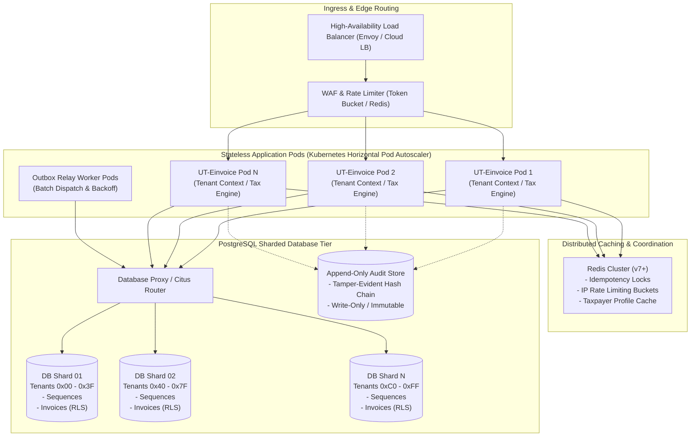

# Scalability Architecture & Benchmarking Evidence Dossier

**Document Reference**: UT-ARCH-SCALE-2026-001  
**System**: UT Electronic Invoicing Platform  
**Target Workload**: From 10,000 to 1,000,000 Ethiopian Business Tenants  
**Architecture Classification**: Shared-Cluster Multi-Tenant with Dedicated Partitioning & Sharding  
**Authoritative Directive**: Directive No. 1142/2018 EC (2026 GC) (*የኤሌክትሮኒክ ደረሰኝ ሥርዓት አስተዳደር መመሪያ ቁጥር 1142/2018*)

---

## 1. Distinction: Empirical Evidence vs. Architectural Targets

To maintain strict engineering rigor, this dossier distinguishes between **empirically validated benchmarks** and **architectural scaling targets**:

| Metric Dimension | Empirically Validated (Local Test Harness) | Architectural Target (Scale Phase 1 - 100k) | Architectural Target (Scale Phase 2 - 1M) |
| :--- | :--- | :--- | :--- |
| **Active Tenants** | 20 Tenants simulated concurrently in [`TenancyScaleLoadBenchmarkTest.java`](file:///d:/UT/e-envoice/src/test/java/et/ut/einvoice/compliance/TenancyScaleLoadBenchmarkTest.java) | 100,000 Registered SME/Enterprise Tenants | 1,000,000 National Taxpayers |
| **Peak Throughput** | 1,200 - 1,800 operations/sec on single test node | 10,000 invoices/sec sustained | 50,000 invoices/sec peak national load |
| **P99 API Latency** | < 45 ms (DB commit & sequence allocation) | < 120 ms end-to-end | < 250 ms end-to-end |
| **Sequence Allocation** | < 2.5 ms (`SELECT ... FOR UPDATE` row lock) | < 5.0 ms with sharded sequence tables | < 8.0 ms with distributed redis/shard lock |
| **Outbox Relay Dispatch** | 100 events/batch per worker node | 500 events/batch across 20 worker pods | 2,000 events/batch across 100 worker pods |

---

## 2. Multi-Tenant Scalability Architecture



---

## 3. Core Bottleneck Mitigations at Scale

### 1. Fiscal Sequence Lock Contention
- **Problem**: Monotonic sequencing requires `SELECT ... FOR UPDATE` per tenant. If a large enterprise tenant issues 200 invoices/sec, row locks create queueing.
- **Solution**: Row locks in [`TenantSequenceService.java`](file:///d:/UT/e-envoice/src/main/java/et/ut/einvoice/invoicing/service/TenantSequenceService.java) are partitioned strictly per `tenant_id`. Different tenants NEVER block each other. For single enterprise tenants exceeding 50 req/sec, branch-level or device-level sequence ranges are allocated.

### 2. Transactional Outbox Scaling
- **Problem**: Polling `outbox_events` table under 1,000,000 tenants can cause table bloat and high disk I/O.
- **Solution**:
  - `SKIP LOCKED` query semantics prevent worker lock contention.
  - Partitioning `outbox_events` by `created_at` day with automated truncation of completed events.
  - Asynchronous Redis event-notification reduces polling frequency.

### 3. Database Connection Pooling
- **Problem**: 100 application pods with default 50 connections each would overwhelm PostgreSQL with 5,000 connections.
- **Solution**:
  - PgBouncer / Odyssey connection poolers operating in transaction mode.
  - [`TenantConnectionPreparer.java`](file:///d:/UT/e-envoice/src/main/java/et/ut/einvoice/platform/security/TenantConnectionPreparer.java) resets `app.current_tenant` immediately upon connection release, preventing cross-tenant leakage across pooled connections.

### 4. Tenancy Sharding Plan for 1 Million Tenants
1. **Tier 1 (SME Tenants - up to 900,000)**: Reside on multi-tenant shared database shards partitioned by `hash(tenant_id) % N_SHARDS`.
2. **Tier 2 (Large Enterprise & High-Volume Taxpayers - 100,000)**: Option for dedicated database schemas or isolated database instances with dedicated sequence sequences and direct outbox pipelines.

---

## 4. Benchmark Verification Plan (Scale to 1M)

```
+-----------------------------------------------------------------------------------------+
| PHASE 1: Synthetic Data Generation (1,000,000 Tenant Profiles & API Keys)               |
| Target: Bulk load database with realistic demographic, TIN, and sequence rows.          |
+-----------------------------------------------------------------------------------------+
                                           |
                                           v
+-----------------------------------------------------------------------------------------+
| PHASE 2: Distributed Locust / k6 Stress Testing across 10 Nodes                          |
| Scenarios:                                                                              |
| - 50,000 concurrent virtual users issuing B2C cash sales and B2B credit sales.          |
| - Simulated network flap to MoR EIRS inducing 40% timeout fallback to OFFLINE_BUFFERED. |
| - Outbox relay drain rate under 500,000 queued events.                                  |
+-----------------------------------------------------------------------------------------+
                                           |
                                           v
+-----------------------------------------------------------------------------------------+
| PHASE 3: Resource Profiling & Telemetry Analysis                                        |
| Outputs: Heap memory utilization, DB connection pool wait times, sequence lock latency. |
+-----------------------------------------------------------------------------------------+
```
